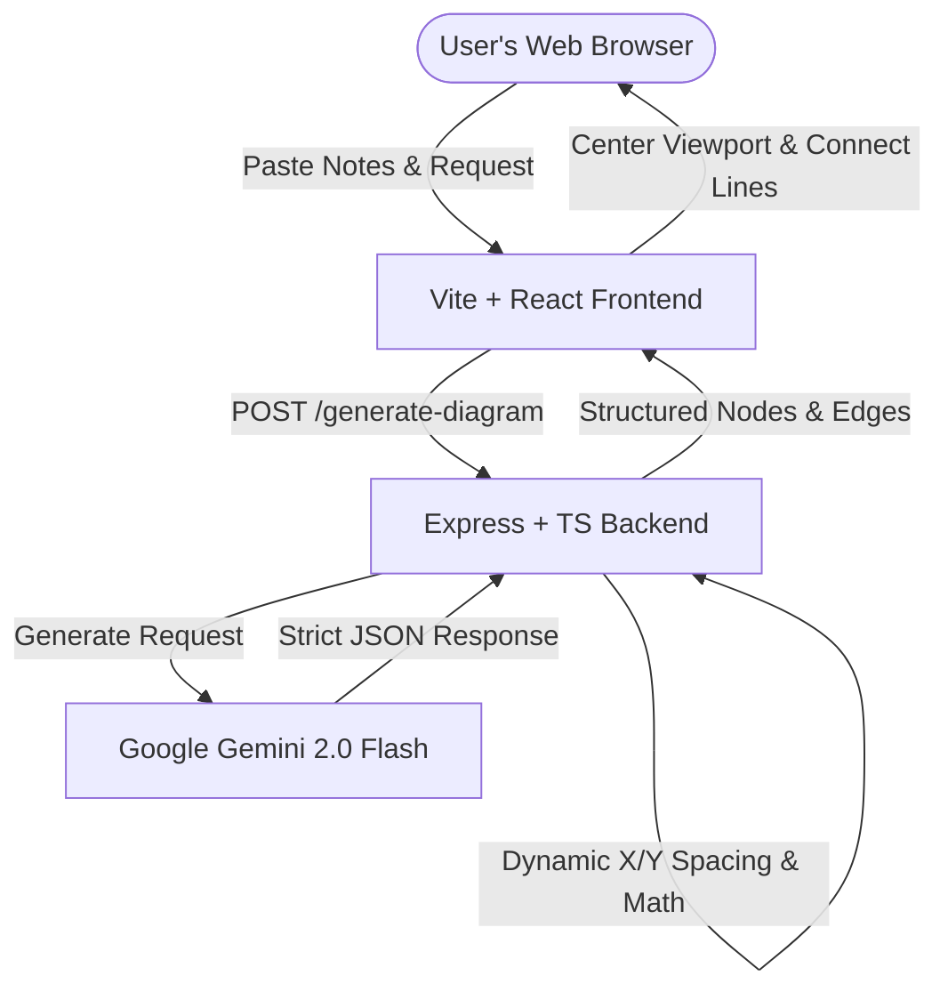

# 🌌 MindMesh AI — Intelligent Mind Maps & Flowcharts

MindMesh AI is a state-of-the-art, high-performance web application that instantly converts raw, unstructured notes into highly organized, beautifully grouped, and perfectly spaced mind-map diagrams using **Gemini AI** and **React Flow**.

Featuring an elegant dark glassmorphic design and intelligent coordinate calculation, it makes notes review, topic planning, and document visualization beautiful and effortless.

---

## 🛠️ Architecture Overview

MindMesh AI uses a highly responsive, decoupled architecture designed for speed and modularity:



---

## ✨ Core Features

*   **Intelligent Mind-Mapping**: Automatically categorizes unstructured notes, creates central root nodes, branches out categories, and cascading details vertically with custom math to ensure **zero overlaps**.
*   **Decoupled Architecture**: High-speed React client paired with a robust Express & TypeScript watch server.
*   **Resilient API Pipeline**: Configured with strict JSON-only outputs, robust regex trailing comma/comment cleaners, and a **3-attempt automatic retry loop** to survive LLM hiccups.
*   **Premium Interactive Board**: Full pan/zoom canvas, interactive mini-map navigation, custom glassmorphic React Flow nodes, animated connection paths, and seamless **PNG diagram exports**.
*   **Recruit-Ready Aesthetics**: Stunning dark-mode layout built using rich CSS tokens, harmony colors, elegant backdrop blurs, and premium micro-animations.

---

## 🚀 Intelligent Layout Engine

Unlike basic flowchart systems that output messy piles of overlapping nodes, MindMesh AI features an **intelligent hierarchical spacing engine**:

| Node Level | Placement Strategy | Grid / Math Rules |
| :--- | :--- | :--- |
| **Root Node** | Centralized anchor | Fixed at coordinates `x: 0, y: 0` |
| **Category Nodes** | Horizontal branching | Balanced along the X-axis (`x: -600, -300, 0, 300, 600`) at `y: 150` |
| **Detail Nodes** | Vertical cascade chains | Nested directly beneath parent category `X` coordinates at `y: 300, 450, 600...` |

---

## 🔧 Production-Ready Backend Audit

The backend server is built to be robust, secure, and production-ready:
1.  **Stable LLM Base**: Powered by standard production-grade `gemini-2.0-flash`.
2.  **Strict Schema Enforcement**: Utilizes `responseMimeType: 'application/json'` to guarantee standard JSON payloads.
3.  **Automatic Retries**: Implements a 3-attempt request loop to transparently recover from transient API limits or network drops.
4.  **Error Interceptor**: Cleanly translates complex, raw Google AI Studio quota metrics into elegant, human-readable instructions.
5.  **Strict Security**: Strictly isolates API keys inside `.env` configurations that are blocked from ever leaking via git tracking.

---

## 🚀 Setup & Local Execution

### Prerequisites
*   **Node.js**: v18 or later
*   **Gemini API Key**: Secure from [Google AI Studio](https://aistudio.google.com/)

---

### 1️⃣ Backend Setup (`server/`)
```bash
# Navigate to backend folder
cd server

# Create env file and input your Gemini API Key
cp .env.example .env

# Install dependencies and start hot-reload development server
npm install
npm run dev
```

*   **Service Port**: Runs on [http://localhost:3001](http://localhost:3001)
*   **Environment Configuration** (`server/.env`):
    *   `GEMINI_API_KEY` (Required)
    *   `PORT` (Optional, Default: `3001`)

---

### 2️⃣ Frontend Setup (`client/`)
In a new terminal:
```bash
# Navigate to frontend folder
cd client

# Create env file and map target API URL
cp .env.example .env

# Install dependencies and launch Vite dev server
npm install
npm run dev
```

*   **Client Address**: Active at [http://localhost:5173](http://localhost:5173)
*   **Environment Configuration** (`client/.env`):
    *   `VITE_API_URL` (Optional, Default: `http://localhost:3001`)

---

## 📦 Production Builds

To compile and package the assets for high-performance deployments:

*   **Build Frontend Bundle**:
    ```bash
    cd client
    npm run build
    ```
*   **Compile Backend TypeScript**:
    ```bash
    cd server
    npm run build
    ```


